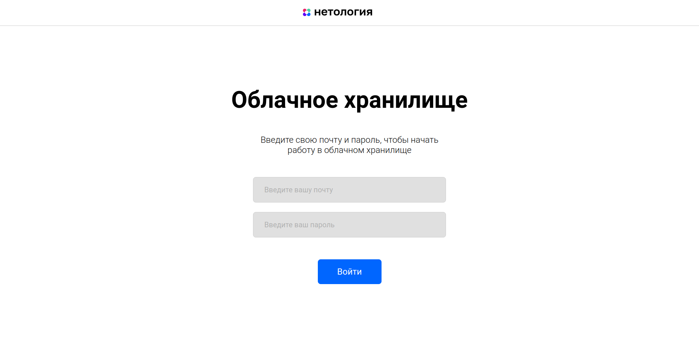
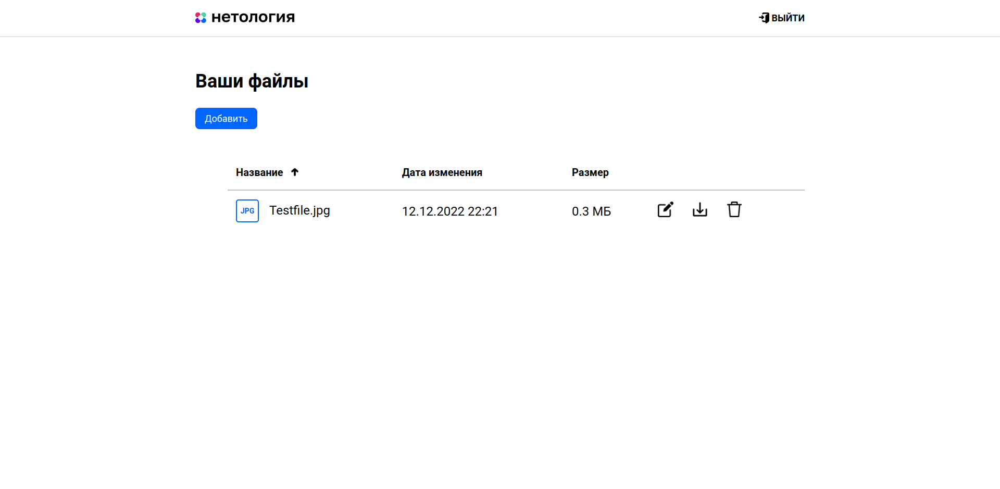
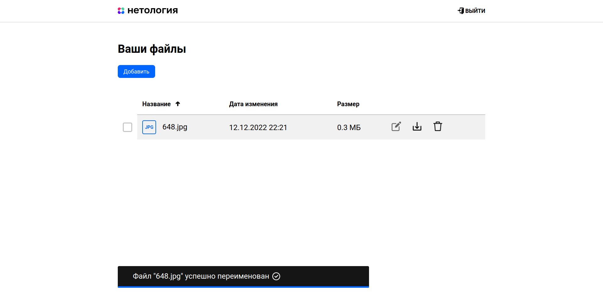
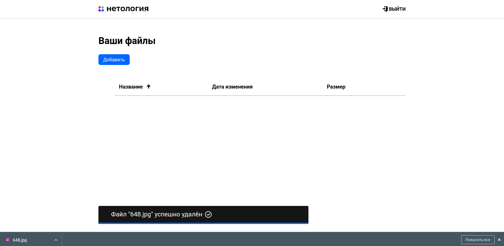

# Дипломная работа “Облачное хранилище”

## Описание проекта

Разработать приложение - REST-сервис. Сервис должен предоставить REST интерфейс для возможности загрузки файлов и вывода списка уже загруженных файлов пользователя. 
Все запросы к сервису должны быть авторизованы. Заранее подготовленное веб-приложение (FRONT) должно подключаться к разработанному сервису без доработок, 
а также использовать функционал FRONT для авторизации, загрузки и вывода списка файлов пользователя.

## Описание и запуск FRONT

1. Установить nodejs (версия не ниже 14.15.0) на компьютер следуя инструкции: https://nodejs.org/ru/download/
2. Скачать [FRONT](https://github.com/netology-code/jd-homeworks/tree/master/diploma/netology-diplom-frontend) (JavaScript)
3. Перейти в папку FRONT приложения и все команды для запуска выполнять из нее.
4. Следуя описанию README.md FRONT проекта запустить nodejs приложение (npm install...)
5. Можно задать url для вызова своего backend сервиса:
    1. В файле `.env` FRONT (находится в корне проекта) приложения нужно изменить url до backend, например: `VUE_APP_BASE_URL=http://localhost:8080`
    2. Пересобрать и запустить FRONT снова: `npm run build`
    3. Измененный `url` сохранится для следующих запусков.
6. По-умолчанию FRONT запускается на порту 8080 и доступен по url в браузере `http://localhost:8080`

> Для запуска FRONT приложения с расширенным логированием нужно использовать команду: npm run serve

## Запуск BACK
1. Скачать этот проект, выполнить maven -> clean -> package
2. Запустить docker-compose.yaml

## Тестовые данные
1. login: testlogin@mail.ru, password: password
2. login: secondlogin@mail.ru, password: password

## Показ работы
### Страница авторизации

### Страница после авторизации

### Переименование

### Скачивание

### Удаление

